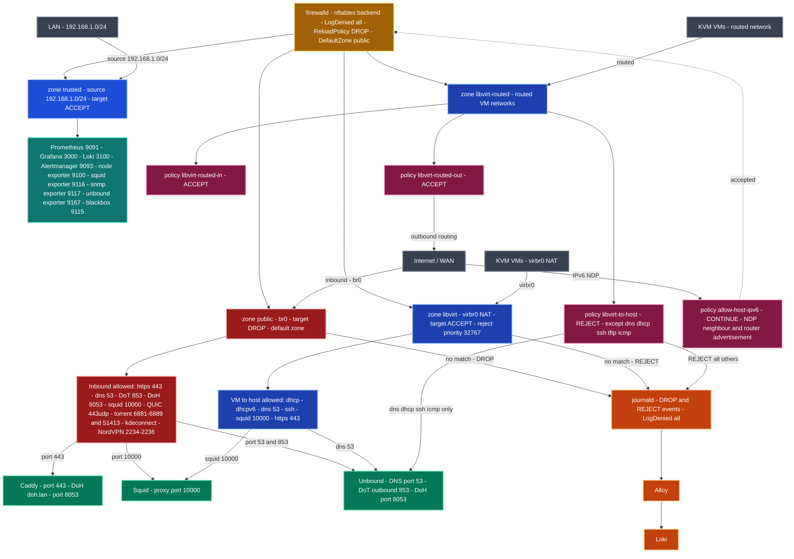

# firewalld-tumbleweed-config


Production-ready firewalld configuration for **openSUSE Tumbleweed** — nftables backend, zone-based design hardened for a desktop with KVM virtualization, a full monitoring stack (Prometheus, Grafana, Loki), and a privacy-first network stack (Squid + Unbound + Caddy).

Deployed and validated on a live system. Every zone and every open port has a documented reason.

---

## Architecture overview

firewalld uses a **zone-based model**: each network interface or traffic source is assigned to a zone, and each zone defines what is allowed. This is fundamentally different from writing raw iptables rules — zones are named, reusable, and composable.

On top of zones, **policies** handle traffic *between* zones (e.g., VM traffic toward the host). This makes the firewall readable and auditable at a glance.



---

## Global settings (`firewalld.conf`)

| Setting | Value | Why |
|---------|-------|-----|
| `DefaultZone` | `public` | All unassigned interfaces fall into the strictest zone |
| `FirewallBackend` | `nftables` | Modern kernel framework — replaces deprecated iptables |
| `LogDenied` | `all` | Every dropped/rejected packet is logged — essential for auditing |
| `ReloadPolicy` | `INPUT:DROP,FORWARD:DROP,OUTPUT:DROP` | Traffic is dropped during rule reload — no exposure window |
| `IPv6_rpfilter` | `yes` | Reverse path filter for IPv6 — drops spoofed packets |
| `RFC3964_IPv4` | `yes` | Blocks 6to4 traffic toward private IPv4 ranges |
| `Lockdown` | `no` | D-Bus access not locked (firewall-config and NetworkManager need it) |

---

## Zones

### `public` — default zone (DROP)

The strictest zone. Applied to all interfaces not explicitly assigned elsewhere, including `br0` (KVM bridge). Default target is **DROP** — unsolicited traffic is silently discarded.

**Services allowed:**

| Service | Purpose |
|---------|---------|
| `https` / `http` | Web browsing |
| `dns` | DNS resolution (Unbound on port 53) |
| `dns-over-tls` | DNS-over-TLS (port 853) |
| `dhcp` / `dhcpv6-client` | DHCP address assignment |
| `squid` | Squid proxy (port 3128) |
| `kdeconnect` | KDE Connect integration |
| `samba-client` | SMB/CIFS client |
| `ws-discovery` | Windows network discovery |

**Custom ports:**

| Port | Protocol | Service / Purpose |
|------|----------|-------------------|
| `443/udp` | UDP | HTTP/3 — QUIC protocol for browsers |
| `2019` | TCP | Caddy admin API and local DoH endpoint |
| `8053` | TCP | Unbound DoH listener (proxied by Caddy) |
| `854` | TCP | Alternate DNS-over-TLS port |
| `2234–2236` | TCP+UDP | NordVPN OpenVPN tunnel ports |
| `3401` | UDP | NordVPN additional tunnel port |
| `6881–6889` | TCP+UDP | BitTorrent (Transmission) |
| `51413` | TCP+UDP | Transmission default peer port |
| `8000–8001` | TCP+UDP | Local web development servers |
| `8005` / `8040` / `8120` | TCP | Local application endpoints |
| `8400` / `8500` | TCP | Local service endpoints |
| `9000` | TCP | Local management interface |
| `10000` | TCP | Remote management |
| `1755` | TCP | Legacy media streaming (MMS) |

---

### `trusted` — LAN monitoring stack (ACCEPT)

Restricted to the LAN subnet `192.168.1.0/24`. Accepts all traffic from local machines. Used to expose the monitoring stack to the local network without opening it to the internet.

**Monitoring ports:**

| Port | Service |
|------|---------|
| `9090` | Cockpit (web admin) |
| `9091` | Prometheus |
| `9093` | Alertmanager |
| `9100` | node_exporter |
| `9115` | blackbox_exporter |
| `9116` | SNMP exporter |
| `9117` | Jackett exporter |
| `9127` | PgBouncer exporter |
| `9167` | Custom exporter |
| `9177` | Custom exporter |
| `9444` | Custom exporter |
| `3000` | Grafana |
| `3100` | Loki |

> These ports are **not open to the internet** — they are bound to the trusted zone which only accepts traffic from `192.168.1.0/24`.

---

### `libvirt` — KVM virtual machines (ACCEPT)

Applied automatically by libvirt to KVM bridge interfaces. Default target **ACCEPT** allows all VM-to-VM traffic, while a low-priority `<reject/>` rule (priority 32767) blocks traffic toward the host unless explicitly listed.

**Services allowed toward host:**

| Service | Purpose |
|---------|---------|
| `dhcp` / `dhcpv6` | IP address assignment for VMs |
| `dns` | Name resolution via Unbound |
| `ssh` | Management access to host |
| `tftp` | PXE boot support |
| `squid` | Proxy access for VMs |
| `https` + `443/udp` | HTTPS and HTTP/3 for VMs |

---

### `libvirt-routed` — routed KVM networks

Used for libvirt routed (non-NAT) virtual networks. Traffic routing is controlled by policies rather than zone rules.

---

### `docker` — Docker bridge (ACCEPT)

Applied to `docker0`. All traffic accepted — Docker manages its own iptables/nftables rules internally.

---

### Other zones (standard, unmodified)

| Zone | Target | Usage |
|------|--------|-------|
| `block` | REJECT | Explicitly blocked sources |
| `drop` | DROP | Silent drop — no response sent |
| `dmz` | default | SSH only — isolated servers |
| `external` | default | SSH + masquerade — WAN-facing |
| `home` | default | SSH, mDNS, Samba, KDE Connect |
| `internal` | default | SSH, mDNS, Samba |
| `work` | default | SSH, DHCPv6 |

---

## Policies

Policies control traffic **between zones** — they complement zones which only control traffic *within* a zone.

| Policy | Ingress | Egress | Target | Purpose |
|--------|---------|--------|--------|---------|
| `allow-host-ipv6` | ANY | HOST | CONTINUE | Allows NDP/RA for host IPv6 (neighbor discovery, router advertisements) |
| `libvirt-routed-in` | ANY | libvirt-routed | ACCEPT | Allows inbound traffic to routed VMs |
| `libvirt-routed-out` | libvirt-routed | ANY | ACCEPT | Allows routed VMs to reach the network |
| `libvirt-to-host` | libvirt-routed | HOST | REJECT | Blocks VMs from reaching the host — only DNS, DHCP, SSH, TFTP, ICMP allowed |

> `libvirt-to-host` is the key isolation policy: VMs cannot freely connect to the host — they can only use the services they need to function.

---

## Lockdown whitelist

Limits which applications can modify firewalld rules via D-Bus:

| Entity | Why |
|--------|-----|
| `firewall-config` (Python) | GUI management tool |
| `user id 0` (root) | System administration |
| `NetworkManager_t` (SELinux) | Interface zone assignment |
| `virtd_t` (SELinux) | libvirt bridge management |

---

## Repository structure

```
firewalld-tumbleweed-config/
├── firewalld.conf              # Global daemon settings
├── lockdown-whitelist.xml      # D-Bus access control
├── zones/
│   ├── public.xml              # Default zone — DROP, br0, all custom ports
│   ├── trusted.xml             # LAN only — monitoring stack
│   ├── libvirt.xml             # KVM VMs — ACCEPT + host reject rule
│   ├── libvirt-routed.xml      # Routed KVM networks
│   ├── docker.xml              # Docker bridge — ACCEPT
│   ├── block.xml               # REJECT zone
│   ├── drop.xml                # DROP zone
│   ├── external.xml            # WAN + masquerade
│   ├── home.xml                # Home network
│   ├── internal.xml            # Internal network
│   ├── dmz.xml                 # DMZ — SSH only
│   └── work.xml                # Work network
├── policies/
│   ├── allow-host-ipv6.xml     # NDP/RA for host IPv6
│   ├── libvirt-routed-in.xml   # Inbound to routed VMs
│   ├── libvirt-routed-out.xml  # Outbound from routed VMs
│   └── libvirt-to-host.xml     # VM to host isolation (REJECT)
└── examples/                   # Real terminal output for each command below
```

---

## Requirements

| Component | Version |
|-----------|---------|
| openSUSE | Tumbleweed (also compatible with Leap) |
| firewalld | 1.x+ |
| kernel | 5.x+ (nftables support) |

---

## Installation

### 1. Backup current configuration

```bash
sudo cp -r /etc/firewalld /etc/firewalld.bak.$(date +%Y%m%d)
```

### 2. Deploy files

```bash
sudo cp firewalld.conf /etc/firewalld/
sudo cp lockdown-whitelist.xml /etc/firewalld/
sudo cp zones/*.xml /etc/firewalld/zones/
sudo cp policies/*.xml /etc/firewalld/policies/
```

### 3. Adapt to your network

Edit `zones/trusted.xml` and `zones/public.xml` to match your setup:

| Placeholder | Replace with |
|-------------|-------------|
| `192.168.1.0/24` | Your LAN subnet (trusted zone source) |
| `br0` | Your KVM bridge interface (public zone) |

### 4. Reload

```bash
sudo firewall-cmd --reload
sudo firewall-cmd --list-all-zones
```

---

## Useful commands

```bash
# Show all active zones and their rules
sudo firewall-cmd --list-all-zones
# → see examples/01-list-all-zones/output.txt

# Show active policies
sudo firewall-cmd --list-all-policies
# → see examples/02-list-all-policies/output.txt

# Check what zone an interface belongs to
sudo firewall-cmd --get-zone-of-interface=br0
# → see examples/03-get-zone-of-interface/output.txt

# Test whether a service or port is allowed in a zone
sudo firewall-cmd --query-service=squid --zone=public
# → see examples/04-query-service/output.txt

# Live log of denied packets
sudo journalctl -f | grep "FINAL_REJECT\|_DROP"
# → see examples/05-log-denied/output.txt
```

---

## Integration

| Component | Role |
|-----------|------|
| [squid-tumbleweed-config](https://github.com/crisis1er/squid-tumbleweed-config) | Squid proxy allowed in public and libvirt zones |
| [unbound-tumbleweed-config](https://github.com/crisis1er/unbound) | DNS/DoT allowed in public zone, DoH on port 8053 |
| [sysctl-tumbleweed-config](https://github.com/crisis1er/sysctlconf) | `ip_forward=1` and conntrack settings complement firewalld |
| Prometheus + Grafana + Loki | All exporter ports locked to trusted zone (LAN only) |
| KVM / libvirt | libvirt zone + policies provide full VM isolation |

---

## Contributing

Issues and pull requests are welcome.
Please include your firewalld version (`firewall-cmd --version`) and openSUSE version in bug reports.

---

## License

MIT License — see [LICENSE](LICENSE) for details.
